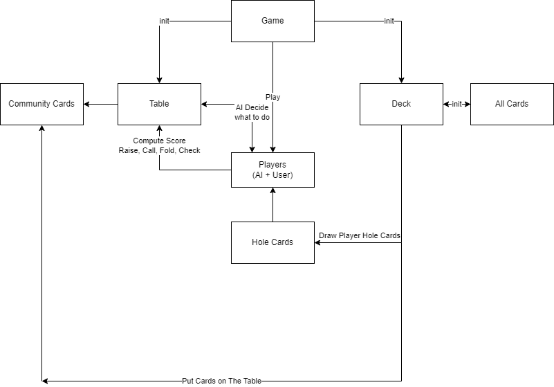

# PIPR 23Z Gra Konsolowa W Pokera

## Karol Kuc
## Wydział Elektroniki i Technik Informacyjnych

## Treść Zadania:
Celem projektu jest zaimplementowanie gry w pokera w odmianie Texas Hold'em.

Powinna być możliwość gry jednoosobowej przeciwko wielu graczom komputerowym. Gra komputera powinna cechować się decyzjami zwiększającymi prawdopodobieństwo wygranej komputera. Nie musi być to optymalny model decyzji, ale powinien być zauważalnie lepszy niż losowe decyzje.

## Dependencje i Uruchamianie Projektu
Do uruchomienia projektu potrzebna jest wersja Pythona obsługująca bibliotekę typing (od 3.5+) chociaż osobiście polecam mieć wersję Python 3.10+ gdyż wcześniej przy pracy z Pythonem 3.8 typing nie działało mi dobrze (choć mógł to być po prostu problem z moim środowiskiem). Nie trzeba instalować żadnych zewnętrznych bibliotek poza ewentualnie pytestem - ja używałem wersji 7.4.2 - zamieszczone w requirements.txt na wszelki wypadek gdyby coś nie działało.

## Koncepcja:
W mojej realizacji projektu postanowiłem położyć duży nacisk na programowanie obiektowe - w związku z tym przedstawiam poniżej krótki opis kilku klas które zaimplementowałem w mojej grze.

## Opisy klas używanych w projekcie:

1. **`Game`**
- Odpowiada za logikę gry, zarządza rundami, kolejnością graczy, oraz ogólnym wynikiem. Odpowiada także za przeprowadzenie rundy licytacji.  Przy tworzeniu instancji tej klasy od razy są także tworzone dwie inne - Deck oraz Table - gdyż są one niezbędne do prawidłowego przebiegu gry. Klasa Game odpowiada także za komunikację z graczem poprzez wyświetlanie komunikatów na ekranie oraz przyjmowanie danych od gracza przy pomocy funkcji input.
2. **`Player`**
    - Jest podstawową reprezentacją gracza:
    - Zawiera jego nazwę, indywidualny_numer_gracza (jest pomocny przy określaniu kolejności graczy), Posiadane Karty (hole_cards) oraz żetony (chips) - zarówno te obecnie używane w grze (in_game) jak i wszystkie jakie posiada. Zmienna is_active służy określeniu czy dany gracz w obecnej rundzie nie zrezygnował z rozgrywki (fold).
    - Odpowiada za podstawowe czynności związane z grą w Pokera: fold, call, raise (tutaj make_raise), check. Warto podkreślić, że w mojej implementacji metoda make_raise działa w sposób polegający na podaniu kwoty o jaką chcemy podbić **ponad** obecną stawkę - w związku z czym do wartości amount wcześniej jest dodawana wartość potrzebna do wyrównania obecnej stawki. Istnieje także metoda do obliczania wyniku gracza - w moim projekcie układy kart w pokerze mają przypisany określony numer określający na ile mocny jest dany układ - najsłabszy (high_card) ma przypisane 0 a najsilniejszy - royal flush - 9.
3. **`AIPlayer`**
    (dziedziczy po Player)
    - Specjalizacja klasy Player dla przeciwników sterowanych przez komputer.
    - Odpowiada za podejmowanie decyzji analizując obecny stan gry bazując na podstawowym algorytmie.

4. **`Card`**
    - Reprezentacja pojedynczej karty
    - Zawiera jej kolor oraz wartość (rank).
    - Kolory/Wartości kart są zawarte w Enumach. Enum odpowaidający za kolor ma zaimplementowaną reprezentację str - bardzo przydatną do wyświetlania kart w czasie rozgrywki.
    - Enum Value każdej wartości przypisuje krotkę zawierającą numer (wykorzystywany później do obliczania wyniku gracza) oraz reprezentację tekstową wartości karty.

5. **`Deck`**
    - Jest to talia kart używana w grze.
    - Odpowiada za zarządzaniem zbiorem kart używanych w grze. Pozwala na tasowanie kart oraz losowanie kart graczy oraz tych układanych na stole.

6. **`Table`**
    - Reprezentuje stół - główne miejsce gdzie toczy się gra.
    - Zawiera informacje jakie karty aktualnie znajdują się na stole, całkowitą pulę w obecnej grze - tu nazwaną stake a także obecną stawkę - current rate która jest bardzo ważna przy przeprowadzaniu rozgrywki gdyż na koniec kazdej rundy licytacji gracz musi do tej stawki wyrównać.
    - Jest to także metoda bardzo przydatna przy wyświetlaniu na ekranie użytkownika aktualnego stanu gry.

## Diagram Architektury Projektu

## Rozpoczęcie Rozgrywki:
1. Najpierw konieczne jest stworzenie instancji klasy game - na której wywołujemy metodę odpowiadającą za rozpoczęcie gry (play). W repozytorium znajduje się już plik main.py który robi to za nas.
2. Użytkownik podaje liczbę graczy uczestniczących w grze a także liczbę żetonów jaką każdy z graczy ma początkowo dostać- standardowe input.
3. Na podstawie danych tworzone są instancje klasy AIPlayer z którymi gracz będzie grał w pokera.
4. Potem już rozpoczyna się standardowa rozgrywka w pokera - gra trwa do tego momentu aż:
    1. Zakończyła się ostatnia runda licytacji
    2. Wszyscy gracze poza jednym spasowali
5. Po zakończeniu rozgrywki gracz może zdecydować czy chce zagrać jeszcze raz, czy może już zakończyć grę.
